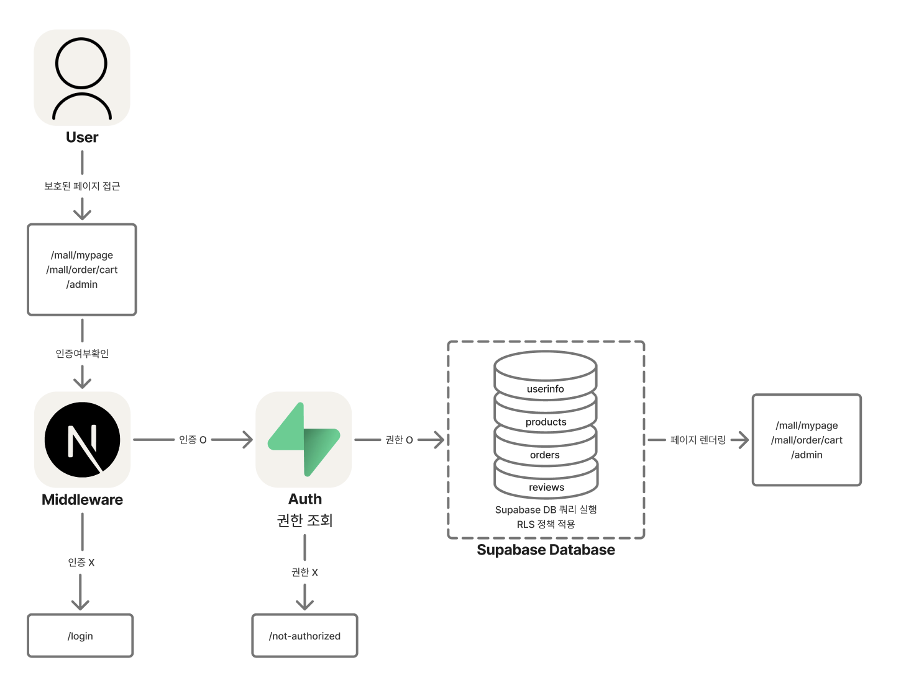

# h-mall 🛒

Next.js + Supabase 기반의 쇼핑몰 프로젝트입니다.  
일반 사용자와 관리자(Admin)의 권한을 구분하여 상품 탐색, 장바구니, 주문, 리뷰, Q&A 기능부터 관리자 전용 상품 관리, 주문 관리 기능까지 제공합니다.

> **배포:** [https://h-mall.vercel.app](https://h-mall.vercel.app)

## 🧪 테스트 계정

| 구분        | ID                      | PW        |
| ----------- | ----------------------- | --------- |
| 관리자 계정 | readAdmin@readAdmin.com | readAdmin |
| 사용자 계정 | testUser@testUser.com   | testUser  |

---

## 📚 프로젝트 소개

- Next.js App Router 기반의 풀스택 쇼핑몰
- Supabase를 활용한 인증, 데이터베이스, 스토리지, 서버리스 API 처리
- React Query, React Hook Form 기반의 상태 관리와 폼 처리
- Zustand 기반 클라이언트 상태 관리 (모달, 유저, 바로구매 상품 상태 등)
- 일반 사용자와 관리자(Admin) 계정 구분 및 미들웨어 기반 권한 처리
- Vercel을 통한 프론트 + 백엔드 통합 클라우드 배포

---

## 🔥 기술 스택

### 🖥️ Frontend

- **Next.js 15 (App Router)**
  - 서버 컴포넌트, 클라이언트 컴포넌트 혼합
  - RSC + SSR + CSR 아키텍처
- **React 19**
- **TypeScript 5**
- **Tailwind CSS 3**
- **React Query (TanStack Query) v5**
  - 서버 상태 및 캐싱
- **React Hook Form**
  - 폼 상태 및 검증
- **Zustand**
  - 클라이언트 상태 관리 (모달 상태, 유저 상태, 바로구매 상품 상태 등)

---

### 🔗 Backend / Infra

- **Supabase**
  - Database (PostgreSQL)
  - Auth (JWT + Session 기반)
  - Storage (이미지 및 파일 저장)
  - Edge Functions (서버리스 API)
- **Vercel**
  - 프론트엔드 + API + 서버리스 백엔드 배포

---

## ✨ 주요 기능 (Features)

### ## 🔐 RBAC 기반 통합 인증/인가 아키텍처 (Next.js Middleware + Supabase Auth + RLS)



### 🛍️ 사용자 (User)

- 상품 카테고리 및 상세 페이지 탐색
- 상품 리스트 페이지 및 상품 검색 페이지에 무한 스크롤 적용
- 장바구니 담기, 수정, 삭제
- 주문 생성 및 주문 내역 조회
- 상품 리뷰 작성/수정/삭제
- 상품 QnA 등록/수정/삭제 (비밀글 지원)
- 마이페이지에서 개인 정보 및 주문 관리

### 🔧 관리자 (Admin)

- 상품 목록 조회, 등록, 수정, 삭제
- 카테고리 및 섹션 관리
- 주문 내역 관리
- 리뷰 및 QnA 관리 (답변 가능)

### 🔐 인증 및 권한

- Supabase 기반 회원가입/로그인/로그아웃
- 미들웨어를 통한 접근 제어 (관리자/일반 사용자 구분)
- **Zustand 기반 클라이언트 상태 관리로 유저 정보 전역 상태 처리**

### 📦 기타

- 반응형 UI
- 이미지 스토리지 연동 (Supabase Storage)
- 서버 액션(Server Actions) 기반 API 처리
- React Query 기반 서버 상태 관리 및 캐싱
- Zustand를 활용한 글로벌 상태 관리

---

## ✅ 상태 관리 전략

- **서버 상태**
  - React Query
    - API 데이터와 서버 상태 캐싱 및 동기화
- **클라이언트 상태**
  - Zustand
    - 로그인 유저 상태 관리 (`useUserStore`)
    - 모달 상태 관리 (`useModalStore`)
    - 바로구매 상품 상태 관리 (`useModalStore`)
    - UI 인터랙션 및 클라이언트 전용 상태 간소화

---

## 🧠 렌더링 전략

### **🛒 MALL 섹션**

| **경로**                            | **렌더링 방식**          | **선택 이유 및 설명**                                                        |
| ----------------------------------- | ------------------------ | ---------------------------------------------------------------------------- |
| /mall/search                        | **SSR (Dynamic)**        | force-dynamic 설정. 실시간 검색 결과 반영 필수. 정적 캐싱 부적절.            |
| /mall/order/cart                    | **CSR**                  | 로그인 유저별 장바구니. React Query 혹은 localStorage 기반 상태. SEO 불필요. |
| /mall/order/checkout                | **SSR (Dynamic)**        | 민감한 결제정보, 사용자 맞춤 배송/포인트 정보 포함. 서버에서 직접 렌더링.    |
| /mall/order/checkout/confirmed/[id] | **SSR (Dynamic Route)**  | 주문 완료 ID별 데이터 표시. 각 사용자별 결과가 달라 서버 렌더링 필요.        |
| /mall/catalog/[id]                  | **SSR**                  | 상품 상세 정보 fetch 및 SEO 최적화. 클라 컴포넌트 포함해도 SSR 가능.         |
| /mall/category                      | **SSG**                  | 정적 페이지로 빌드 가능. SEO에는 긍정적, 실시간 데이터 없음.                 |
| /mall/category/list                 | **SSG + CSR (Suspense)** | 필터링/탭은 CSR로 처리, 페이지 구조는 SSG. UX + 성능 최적 조합.              |
| /mall/mypage                        | **SSR**                  | 로그인 사용자 기반 fetch. React Server Component로 SSR 처리.                 |
| /mall/mypage/orders                 | **CSR**                  | 주문 내역은 로그인 후 사용자만 접근. 내부 상태 및 hook 사용.                 |
| /mall/mypage/qna                    | **CSR**                  | 개인 Q&A 데이터, CSR로 관리하며 UX 중심 설계.                                |
| /mall/mypage/reviews                | **CSR**                  | 유저 리뷰 목록. React Query 기반 상태.                                       |
| /mall/mypage/layout.tsx             | **CSR Layout**           | useSearchParams, 동적 탭 전환 등 UI 조작이 많음. 'use client' 선언.          |

---

### **🔧 ADMIN 섹션**

| **경로**          | **렌더링 방식** | **선택 이유 및 설명**                                                        |
| ----------------- | --------------- | ---------------------------------------------------------------------------- |
| /admin/product    | **CSR**         | 관리자 상품 관리 UI는 상호작용/폼 중심. SSR은 불필요하며 상태가 많음.        |
| /admin            | **SSG**         | 빈 또는 리디렉션 페이지. 서버/클라이언트 상태 요구 없음. 정적 빌드 적합.     |
| /admin/layout.tsx | **CSR Layout**  | 사이드바 토글, 클라이언트 상태 있음. 모바일 지원도 고려한 CSR 컴포넌트 구성. |

---

### **🔐 LOGIN 섹션**

| **경로**           | **렌더링 방식**   | **선택 이유 및 설명**                                                          |
| ------------------ | ----------------- | ------------------------------------------------------------------------------ |
| /login             | **CSR + SSG**     | 로그인 페이지는 입력 폼 중심, SEO 중요성 낮음. 정적 빌드 후 클라이언트 렌더링. |
| /signup            | **CSR**           | 'use client' + Supabase 기반 인증 처리. 실시간 유효성 검사, UX 중심.           |
| /signup/layout.tsx | **SSR (default)** | 단순 wrapper. 특별한 클라이언트 동작 없음. 기본 서버 컴포넌트로 렌더링.        |

---

## 🚀 배포 및 운영

- **Vercel**
  - 프론트엔드 + 서버리스 API 통합 배포
- **Supabase**
  - 데이터베이스, 인증, 스토리지, Edge Functions

---

## 📂 폴더 구조 (Folder Structure)

```plaintext
src/
├── actions/           # 서버 액션 (Server Actions)
│   ├── auth/          # 인증 관련 액션
│   ├── menu/          # 메뉴/카테고리 관련 액션
│   └── product/       # 상품 관련 액션
├── app/               # Next.js App Router 라우트
│   ├── (admin)/       # 관리자 페이지 그룹
│   ├── (login)/       # 로그인 및 회원가입 페이지 그룹
│   ├── (mall)/        # 사용자용 쇼핑몰 페이지 그룹
│   ├── auth/          # 인증 콜백 및 에러 처리
│   ├── layout.tsx     # 전역 레이아웃
│   ├── page.tsx       # 메인 페이지
│   └── not-found.tsx  # 404 처리
├── assets/            # 아이콘, 폰트, 스타일 등 정적 자산
├── components/        # UI 컴포넌트
├── stores/            # Zustand 상태 관리
├── data/              # 키워드 데이터, 메뉴 데이터
├── hooks/             # 커스텀 훅 (useCart, useOrder 등)
├── library/           # Supabase 클라이언트 및 유틸
├── types/             # 전역 타입 정의
├── middleware.ts      # 인증 및 권한 미들웨어
```

## 🔐 미들웨어 인증 및 권한 처리

### ✅ 경로 접근 규칙

| 경로                    | 권한                            |
| ----------------------- | ------------------------------- |
| `/admin/**`             | **관리자만 접근 가능**          |
| `/order/**`, `/cart/**` | **로그인한 사용자만 접근 가능** |
| `/mypage/**`            | **로그인한 사용자만 접근 가능** |
| `/checkout/**`          | **로그인한 사용자만 접근 가능** |

### ✅ 동작 방식

- Supabase 세션을 기반으로 JWT 확인
- 미들웨어에서 로그인 상태 및 관리자 권한 판별
- 권한 미충족 시 로그인 페이지 또는 메인 페이지로 리디렉트

## 🗄️ 데이터베이스 구조

### 🔸 주요 테이블

| 테이블명      | 설명                             |
| ------------- | -------------------------------- |
| `users`       | 사용자 정보 (Supabase Auth 연동) |
| `products`    | 상품 정보                        |
| `categories`  | 카테고리 정보                    |
| `sections`    | 중간 카테고리                    |
| `subsections` | 세부 카테고리                    |
| `subtabs`     | 세부 탭                          |
| `cart_items`  | 장바구니 아이템                  |
| `orders`      | 주문 정보                        |
| `order_items` | 주문 상세                        |
| `reviews`     | 상품 리뷰                        |
| `qna`         | 상품 QnA                         |

## 🗺️ H-Mall Database ERD


---

## 🗄️ Tables

### 🛍️ `products`

| Column      | Type      | Description         |
| ----------- | --------- | ------------------- |
| id          | uuid      | PK. Product ID      |
| name        | text      | Product name        |
| description | text      | Product description |
| price       | numeric   | Base price          |
| category_id | uuid      | FK. categories.id   |
| section_id  | uuid      | FK. sections.id     |
| subtab_id   | uuid      | FK. subtabs.id      |
| created_at  | timestamp | Created date        |

---

### 🗂️ `categories`

| Column | Type | Description          |
| ------ | ---- | -------------------- |
| id     | uuid | PK. Category ID      |
| code   | text | Unique category code |
| name   | text | Category name        |

### 🗂️ `sections`

| Column      | Type | Description       |
| ----------- | ---- | ----------------- |
| id          | uuid | PK. Section ID    |
| category_id | uuid | FK. categories.id |
| name        | text | Section name      |

### 🗂️ `subtabs`

| Column     | Type | Description     |
| ---------- | ---- | --------------- |
| id         | uuid | PK. Subtab ID   |
| section_id | uuid | FK. sections.id |
| name       | text | Subtab name     |

---

### 🛒 `cart_items`

| Column     | Type      | Description      |
| ---------- | --------- | ---------------- |
| id         | uuid      | PK. Cart item ID |
| user_id    | uuid      | FK. userinfo.id  |
| product_id | uuid      | FK. products.id  |
| quantity   | int       | Quantity         |
| created_at | timestamp | Created date     |

---

### 🧾 `orders`

| Column       | Type      | Description           |
| ------------ | --------- | --------------------- |
| id           | uuid      | PK. Order ID          |
| user_id      | uuid      | FK. userinfo.id       |
| total_amount | numeric   | Total order amount    |
| status       | text      | Order status          |
| receiver     | text      | Receiver name         |
| phone        | text      | Receiver phone number |
| address      | text      | Receiver address      |
| created_at   | timestamp | Order date            |

### 📦 `order_items`

| Column     | Type    | Description                  |
| ---------- | ------- | ---------------------------- |
| id         | uuid    | PK. Order item ID            |
| order_id   | uuid    | FK. orders.id                |
| product_id | uuid    | FK. products.id              |
| quantity   | int     | Quantity                     |
| unit_price | numeric | Price per unit at order time |

---

### ⭐ `reviews`

| Column     | Type      | Description         |
| ---------- | --------- | ------------------- |
| id         | uuid      | PK. Review ID       |
| user_id    | uuid      | FK. userinfo.id     |
| product_id | uuid      | FK. products.id     |
| rating     | int       | Rating (1-5)        |
| content    | text      | Review content      |
| images     | text[]    | Array of image URLs |
| created_at | timestamp | Created date        |

---

### ❓ `qnas`

| Column     | Type      | Description             |
| ---------- | --------- | ----------------------- |
| id         | uuid      | PK. QnA ID              |
| user_id    | uuid      | FK. userinfo.id         |
| product_id | uuid      | FK. products.id         |
| question   | text      | QnA question            |
| answer     | text      | QnA answer              |
| is_private | boolean   | Private question toggle |
| created_at | timestamp | Created date            |

---

### 👤 `userinfo`

| Column     | Type      | Description  |
| ---------- | --------- | ------------ |
| id         | uuid      | PK. User ID  |
| email      | text      | User email   |
| name       | text      | User name    |
| phone      | text      | User phone   |
| created_at | timestamp | Created date |

---

## 🔍 Views

- 🔍 **`products_with_review`**
  → 상품 정보 + 평균 별점 + 리뷰 수 포함

- 🔍 **`qna_with_user_info`**
  → QnA 정보 + 사용자 정보 포함

- 🔍 **`reviews_with_userinfo`**
  → 리뷰 + 작성자 이름 및 이메일 포함

---

## 🚦 Row Level Security (RLS) Policy

| Table       | Public | Logged-In User | Admin |
| ----------- | ------ | -------------- | ----- |
| products    | ✅     | ✅             | ✅    |
| categories  | ✅     | ✅             | ✅    |
| sections    | ✅     | ✅             | ✅    |
| subtabs     | ✅     | ✅             | ✅    |
| cart_items  | ❌     | ✅ (본인만)    | ✅    |
| orders      | ❌     | ✅ (본인만)    | ✅    |
| order_items | ❌     | ✅ (본인만)    | ✅    |
| reviews     | ❌     | ✅ (본인만)    | ✅    |
| qnas        | ❌     | ✅ (본인만)    | ✅    |
| userinfo    | ❌     | ✅ (본인만)    | ✅    |

---
